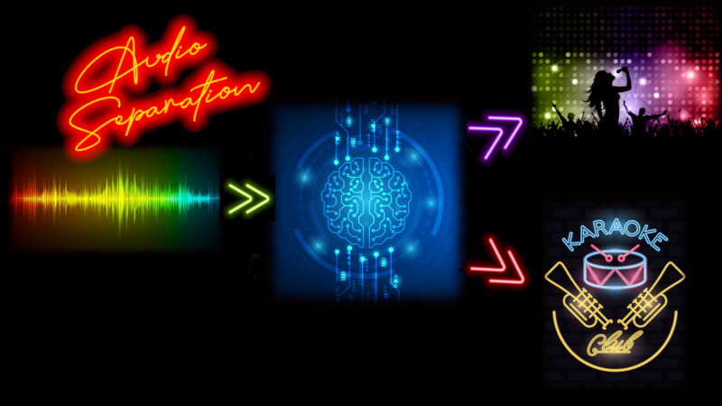
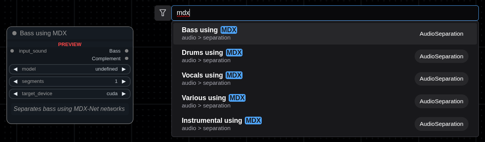
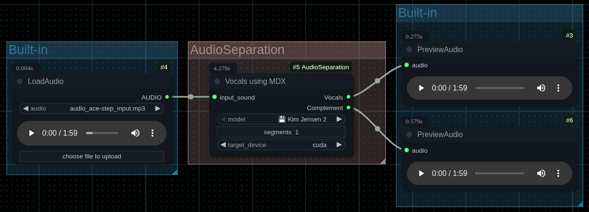

<div align="center">

# Audio Separation &#x0001F3A4;&#x0001F39B;&#xFE0F;



</div>

## Overview

**AudioSeparation** is both, a ComfyUI group of nodes and a command line tool, to do
audio demixing, also known as audio separation.

From an audio the objective is to separate the vocals, instruments, drums, bass, etc.
from the rest of the sounds.

To achieve this we use [MDX Net](https://arxiv.org/abs/2111.12203) and
[Demucs](https://github.com/facebookresearch/demucs) neural networks (models).
**AudioSeparation** currently supports [46 models](https://huggingface.co/set-soft/audio_separation)
mostly collected by the [UVR5](https://github.com/Anjok07/ultimatevocalremovergui) project.

The MDX models are small (from 21 MB to 65 MB), but really efficient, the Demucs models are bigger
(from 84 MB to 870) MB, but slightly better, and supports 4 stems.
MDX models specialized on different stems are provided.
We support more than one model for each task because some times a model will perform better
for a song and worst for others.

We support two *karaoke* models. They are slightly different to regular models because they try
to keep the secondary vocals along with the instruments.

The objectives for these nodes are:

- Multiple stems (Vocals, Instruments, Drums, Bass, etc.)
- Easy of use
- Clear download (with progress and known destination)
- Support for all possible input audio formats (mono/stereo, any sample rate, any batch size)
- Good quality vs size, or you can choose better quality using Demucs
- Reduced dependencies

---

## &#x0001F4DC; Table of Contents

*   [Overview](#overview)
*   &#x0001F680; [Installation](#-installation)
    *   [ComfyUI Nodes](#comfyui-nodes)
    *   [Command Line Tool](#command-line-tool)
    *   [Models](#models)
*   &#x0001F4E6; [Dependencies](#-dependencies)
*   &#x0001F5BC;&#xFE0F; [Usage](#&#xFE0F;-usage)
    *   [ComfyUI](#comfyui)
    *   [Command Line](#command-line)
*   &#x2728; [Nodes](#-nodes)
    *   [Vocals using MDX](#vocals-using-mdx)
    *   [Demucs Audio Separator](#demucs-audio-separator)
*   &#x0001F4DD; [Usage Notes](#-usage-notes)
*   &#x2696;&#xFE0F; [License](#&#xFE0F;-license)
*   &#x0001F64F; [Attributions](#-attributions)

___

## &#x0001F680; Installation

### ComfyUI Nodes

You can install the nodes from the ComfyUI nodes manager, the name is *Audio Separation*,
or just do it manually:

1.  Clone this repository into your `ComfyUI/custom_nodes/` directory:
    ```bash
    cd ComfyUI/custom_nodes/
    git clone https://github.com/set-soft/AudioSeparation
    ```
2.  Restart ComfyUI.

The nodes should then appear under the "audio/separation" category in the "Add Node" menu.
You don't need to install extra dependencies.

### Command Line Tool

1. Clone this repository

2. Change to its directory (`cd AudioSeparation`)

3. Install the dependencies, only needed if ComfyUI isn't installed:

```bash
pip3 install -r requirements.txt
```

or

```bash
pip install -r requirements.txt
```

4. Run the scripts like this:

```
python3 tool/demix.py AUDIO_FILE
````

or

```
python tool/demix.py AUDIO_FILE
````

You don't need to install it, you could even add a symlink in `/usr/bin`.

A list of all the available tools can be found [here](tool/README.md).

### Models

Models are automatically downloaded.

When using ComfyUI they are downloaded to `ComfyUI/models/audio/MDX` and `ComfyUI/models/audio/Demucs`.

When using the command line the default is `../models` relative to the script, but you can specify another dir.

If you want to download the models manually you can get the safetensors files from
[here](https://huggingface.co/set-soft/audio_separation/).

For the command line you can also download the ONNX files from other repos.


## &#x0001F4E6; Dependencies

These nodes just uses `torchaudio` (part of PyTorch), `numpy` for math, `safetensors` to load models and `tqdm` for progress bars.
All of them are used by ComfyUI, so you don't need to install any additional dependency on a ComfyUI setup.

The following are optional dependencies:

- `onnxruntime`: if you want to use the ONNX version of the models you'll need the ONNX runtime, but I don't see any advantage. Note that only the command line can handle them.
- `requests`: this is a robust internet connection module. If not installed we use the Python's `urllib` which is fine.
- `colorama`: it helps to generate colored messages (for debug, warning and errors). If not installed we use the most common ANSI escape sequences, supported by most terminals. You might need it for Windows.


## &#x0001F5BC;&#xFE0F; Usage

### ComfyUI

You can start using template workflows, go to the ComfyUI *Workflow* menu and then choose *Browse Templates*,
look for *Audio Separation*

If you want to do it manually you'll find the nodes in the *audio/separation* category.
Or you can use the search menu, double click in the canvas and then type **MDX** (or **Demucs**):



Choose a node to extract what you want, i.e. *Vocals*. The complement output for it will
be the instruments, but using a node for *Instrumental* separation you'll usually get a better result
than using the *Complement* output. In the case of *Demucs* models you get 4 or 6 stems at a time,
the "UVR Demucs" is an exception, it just supports Vocals and Other.

Then simply connect your audio input to the node (i.e. **LoadAudio** node from Comfy core) and
connect its output to some audio node (i.e. **PreviewAudio** or **SaveAudio** nodes from Comfy core).
You'll get something like this:



Now choose a model in the MDX node. On a fresh install all models will have an arrow (⬇️)
indicating it must be downloaded.

Now just run the workflow. That's all.

Note that after downloading a model its name will change and will show a disk (&#x0001F4BE;).
If for some reason the list of models gets out of sync just press `R` to refresh ComfyUI and
select the correct name from the list.

> [!TIP]
> Models are trained using 44.1 kHz audio, to get optimal results use this sample rate.
> The node will convert any sample rate to this.


### Command Line

Use the `demix.py` tool like this

```
$ python3 tool/demix.py AUDIO_FILE
```

To get all the available options use:

```
$ python3 tool/demix.py --help
```

## &#x2728; Nodes

`Vocals using MDX`, `Instrumental using MDX`, `Bass using MDX`, `Drums using MDX` and `Various using MDX`
share the same structure, so here is the first:

### Vocals using MDX
   - **Display Name:** `Vocals using MDX`
   - **Internal Name:** `AudioSeparateVocals`
   - **Category:** `audio/separation`
   - **Description:** Takes one audio input (which can be a batch) separates the vocals from the rest of the sounds.
   - **Inputs:**
     - `input_sound` (AUDIO): The audio input. Can be a single audio item or a batch.
     - `model` (COMBO): The name of the model to use. Choose one from the list.
     - `segments` (INT): How many segments to process at once. More segments needs more VRAM, but the audio might have less discontinuities.
     - `taget_device` (COMBO): The device where we will run the neural network.
   - **Output:**
     - `Vocals` (AUDIO): The separated stem
     - `Complement` (AUDIO): The input audio subtracting the `Vocals`
   - **Behavior Details:**
     - **Sample Rate:** The sample rate of the input is adjusted to 44.1 kHz
     - **Channels:** Mono audios are converted to fake stereo (left == right)
     - **Input Batch Handling:** If `input_sound` is a batch the outputs will be batches. The process is sequential, not parallel.
     - **Missing Models:** They are downloaded and stored under `models/audio/MDX` of the ComfyUI installation

And here is the Demucs node:

### Demucs Audio Separator
   - **Display Name:** `Demucs Audio Separator`
   - **Internal Name:** `AudioSeparateDemucs`
   - **Category:** `audio/separation`
   - **Description:** Takes one audio input (which can be a batch) separates the vocals, drums and bass from the rest of the sounds.
     The node has outputs for guitar and piano, which can be separated by the *Hybrid Transformer 6 sources* model, which is quite
     experimental.
   - **Inputs:**
     - `input_sound` (AUDIO): The audio input. Can be a single audio item or a batch.
     - `model` (COMBO): The name of the model to use. Choose one from the list.
     - `shifts` (INT): Number of random shifts for equivariant stabilization.
        It does extra passes using slightly shifted audio, which can produce better results.
        Higher values improve quality but are slower. 0 disables it.
     - `overlap` (FLOAT): Amount of overlap between audio chunks.
        This is expressed as a portion of the total chunk, i.e. 0.25 is 25%.
        Higher values can reduce stitching artifacts but are slower.
     - `custom_segment` (BOOLEAN): Enable to override the model's default segment length.
        Disabling uses the recommended length from the model file.
        Useful for HDemucs and Demucs models, not much for HTDemucs.
     - segment (INT): Length of audio chunks to process at a time (in seconds).
        Higher values need more VRAM but can improve quality.
     - `taget_device` (COMBO): The device where we will run the neural network.
   - **Output:**
     - `Vocals` (AUDIO): The separated vocals
     - `Drums` (AUDIO): The separated drums. Not for "UVR" version.
     - `Bass` (AUDIO): The separated bass. Not for "UVR" version.
     - `Other` (AUDIO): The separated stuff that doesn't fit in the other outputs
     - `Guitar` (AUDIO): The separated guitar, only for *Hybrid Transformer 6 sources* model, which is quite
     - `Piano` (AUDIO): The separated piano, only for *Hybrid Transformer 6 sources* model, which is quite
   - **Behavior Details:**
     - **Sample Rate:** The sample rate of the input is adjusted to 44.1 kHz
     - **Channels:** Mono audios are converted to fake stereo (left == right)
     - **Input Batch Handling:** If `input_sound` is a batch the outputs will be batches.
     - **Missing Models:** They are downloaded and stored under `models/audio/Demucs` of the ComfyUI installation
     - **Models:** Note that most models are a *bag of models*, this is four models working together.


## &#x0001F4DD; Usage Notes

- **AUDIO Type:** These nodes work with ComfyUI's standard "AUDIO" data type, which is a Python dictionary containing:
  - `'waveform'`: A `torch.Tensor` of shape `(batch_size, num_channels, num_samples)`.
  - `'sample_rate'`: An `int` representing the sample rate in Hz.
- **Logging:** &#x0001F50A; The nodes use Python's `logging` module. Debug messages can be helpful for understanding the transformations being applied.
  You can control log verbosity through ComfyUI's startup arguments (e.g., `--preview-method auto --verbose DEBUG` for more detailed ComfyUI logs
  which might also affect custom node loggers if they are configured to inherit levels). The logger name used is "AudioSeparation".
  You can force debugging level for these nodes defining the `AUDIOSEPARATION_NODES_DEBUG` environment variable to `1`.
- **Models format:** We use safetensors because this format is safer than PyTorch files (.pth, .th, etc.) and doesn't need an extra runtime (like ONNX does)
- **No quantized Demucs:** These models just save download time, but pulls extra dependency (diffq), they are just lower quality versions of their non-quantized counterparts.


## &#x2696;&#xFE0F; License

[GPL-3.0](LICENSE)

The models are under [MIT license](https://opensource.org/license/mit), but aren't in this repo

## &#x0001F64F; Attributions

- Main author: [Salvador E. Tropea](https://github.com/set-soft)
- Assisted by Gemini 2.5 Pro, i.e. most of the inference class and ONNX to safetensors conversion

______

- Various ideas from [DeepExtract](https://github.com/abdozmantar/ComfyUI-DeepExtract) by
  [Abdullah Ozmantar](https://github.com/comfyui-abdozmantar)
- Models collected by the [UVR5 project](https://github.com/Anjok07/ultimatevocalremovergui) and
  found in the [UVR Resources](https://huggingface.co/Politrees/UVR_resources) by
  [Artyom Bebroy](https://github.com/Politrees)
- Demucs models are from Meta Platforms, Inc. Except for the "UVR" version
- The logo image was created using text generated using [Text Studio](https://www.textstudio.com/) and
  resources from [Vecteezy](https://www.vecteezy.com/) by:
     - [Titima Ongkantong](https://www.vecteezy.com/members/titima157)
     - [Chaiwut Sridara](https://www.vecteezy.com/members/cs21)
     - [Kirsty Pargeter](https://www.vecteezy.com/members/kjpargeter2018)
     - [Luz Eugenia Velasquez](https://www.vecteezy.com/members/jemastock)
     - [Paulo Henrique dos Santos](https://www.vecteezy.com/members/pauloh381992288929)
