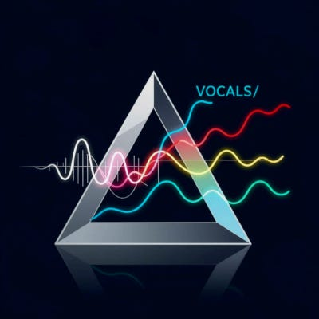
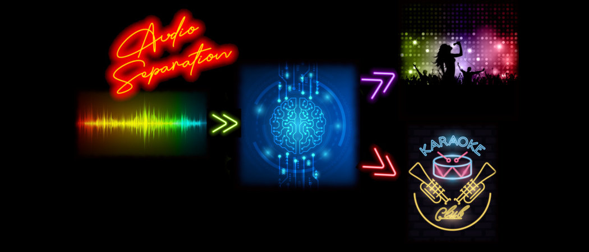

# Audio Separation assets

## Icon


prompt:

```
Icon design, a single, vibrant white soundwave enters a sleek, crystalline triangular prism from the left.
The prism refracts the soundwave, causing it to split into four distinct, brilliantly colored waveforms exiting to the right.
One waveform is glowing red for vocals, one is electric blue for drums, one is deep green for bass, and one is bright yellow for other instruments.

Minimalist, vector art, graphic illustration, glowing neon lines, on a clean dark background. Visually compelling UI icon, 400x400.
```

Model: HiDream I1

Version used:




## Banner



Image composition
